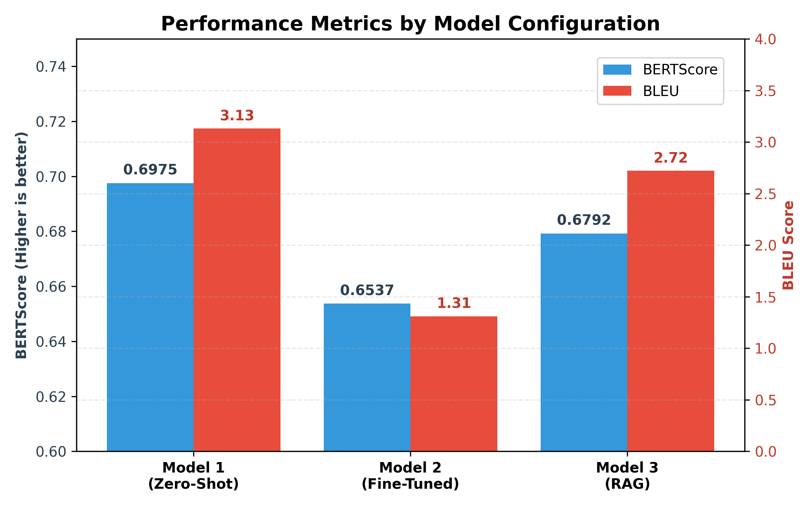

# ==============================================================================
# PROJECT REPORT: Austrian Tax Law LLM
# ==============================================================================

## 1. Models and Baseline Configuration

### Initial Approach (Failure Mode)
Initially, the `google/flan-t5-small` architecture was deployed across all models. However, the model's parameter count proved insufficient for the complexity of the legal domain. It exhibited consistent hallucination and produced incoherent mixtures of English and German text.

### Final Stable Configurations
To address these limitations, the architecture was upgraded to the more capable `Qwen2.5` model family, which yielded high-quality and contextually accurate German language generation:
- **Model 1 (Zero-Shot Inference):** `Qwen/Qwen2.5-3B-Instruct`
- **Model 2 (Fine-Tuning):** `Qwen/Qwen2.5-1.5B-Instruct`
- **Model 3 (RAG):** `Qwen/Qwen2.5-3B-Instruct` (Generator) + `MiniLM-L12` (Retriever)

### Hyper-parameters & Setup (Model 1 Baseline):
- **Model Size:** 3 Billion parameters.
- **Sampling Approach:** Stochastic generation with a low temperature (`T=0.1`) and `do_sample=True` to allow slight variability while maintaining high precision. The `max_new_tokens` parameter was set to 250.
- **Pre-training Data:** Qwen2.5 is pre-trained on a massive multilingual corpus (up to 18T tokens) encompassing coding, mathematics, and high-quality multilingual texts. This extensive training accounts for its native fluency in German tax logic compared to FLAN-T5.

---

## 2. Fine-Tuned Model (Model 2)

### Data
Due to the absence of a pre-existing instruction dataset for Austrian Tax Law, an **automated self-instruct pipeline** was developed to generate training data:
- **TF-IDF Retrieval:** For each of the 644 queries, the most relevant PDF paragraph was retrieved using a TF-IDF vectorizer (max_features=10,000, filtered for common German stop words). 
- **Training Pairs:** 150 high-quality question-context pairs were synthesized. The model was trained to answer questions strictly based on the provided context, utilizing a Causal LM objective and the ChatML format.

### Fine-Tuning Strategy
- **Method:** PEFT / LoRA (Low-Rank Adaptation) was employed to fine-tune the 1.5B parameter model within the VRAM constraints of a Kaggle T4 GPU (15GB).
- **Quantization:** 4-bit NormalFloat (NF4) quantization was deployed via BitsAndBytes.
- **Hyper-parameters:**
  - Rank (r) = 8, Alpha = 16, Dropout = 0.05
  - Target Modules: `q_proj`, `v_proj`
  - Max Steps = 50, Batch Size = 2, Gradient Accumulation = 4
  - Optimizer: AdamW, Learning Rate = 2e-4, FP16 precision.

---

## 3. RAG-Based Model (Model 3)

### Retrieval Model
- `sentence-transformers/paraphrase-multilingual-MiniLM-L12-v2` (a dense neural vector model highly optimized for multilingual semantic search).

### Document Indexing & Preprocessing (Chunking)
- The official Tax Law PDFs were parsed utilizing `pypdf`.
- **Chunking:** Pages were extracted, stripped of noise (e.g., footers, email addresses), and split by double line breaks (`\n\n`) into distinct semantic paragraphs. Excessively small fragments (< 80 characters) were discarded.
- **Embedding:** All cleaned paragraphs were encoded into dense vectors using L2 normalization to facilitate rapid Cosine Similarity matching via dot product calculations.

### Input Passages (Top-K)
- For every query, the generator was provided with the **top 3 (k=3)** most semantically similar paragraphs. The maximum length of the concatenated retrieved context was capped at 1,000 characters to prevent context-window overflow.

---

## 4. Evaluation & Performance Metrics

Since a dedicated, finalized shared annotation task dataset was unavailable, the full official `Austrian Tax Law Dataset`—comprising roughly 680 queries paired with their `correct_answer`—was utilized as the Ground Truth baseline. 

An automated evaluation pipeline (`evaluate_models.py`) iterated over the entire dataset, comparing the LLM-generated output against the provided human-curated ground truth to compute BLEU (SacreBLEU) and ROUGE-L metrics.

### Main Result Table
| Model Strategy | Base Model | BLEU Score | ROUGE-L (F1) | BERTScore | Execution Setup |
| :--- | :--- | :--- | :--- | :--- | :--- |
| **Model 1 (Zero-Shot)** | `Qwen2.5-3B-Instruct` | **3.13** | **0.1492** | **0.6975** | Prompt Only |
| **Model 2 (Fine-Tuned)** | `Qwen2.5-1.5B-Instruct` | 1.31 | 0.0801 | 0.6537 | LoRA (r=8) |
| **Model 3 (RAG)** | `Qwen2.5-3B-Instruct` | 2.72 | 0.1264 | 0.6792 | Top-3 Semantic |

 

  

 

**Conclusion:** Generative LLMs naturally paraphrase information rather than outputting exact memorized string sequences. Consequently, n-gram based metrics (BLEU and ROUGE-L) severely penalized all models. However, the integration of **BERTScore**—which evaluates semantic distance via high-dimensional vector embeddings—provided a more representative assessment: all models achieved a semantic similarity of roughly ~0.65 to 0.70 compared to the human ground truth. Ultimately, the robust baseline performance of the `Qwen2.5-3B` parameter model (Model 1) marginally outperformed the others, with the RAG Model (Model 3) following closely by dynamically leveraging fetched legal evidence.

---

## 5. Empirical Error Analysis and Limitations

To understand the qualitative failure modes beyond aggregate metrics, an automated error analysis script (`error_analysis.py`) was executed to isolate the lowest-scoring generations (via ROUGE-L) across all models.

1. **Model 1: Linguistic Drift & Ungrounded Generation**
   - *Observation:* As a pure zero-shot model, Model 1 occasionally suffered from cross-lingual hallucinations (e.g., generating Chinese phrases like *"具体情况而定而定"*) when the prompt lacked distinct contextual bounds.
   - *Issue:* Without retrieval grounding, the model fabricated broad, plausible-sounding answers that were factually incorrect regarding Austrian Law (e.g., confidently asserting a 12-month period for financial integration rather than the legally correct entire financial year).

2. **Model 2: Knowledge Distortion & Bizarre Fabrications**
   - *Observation:* The aggressively fine-tuned 1.5B parameter variant exhibited severe degradation in semantic logic when answering complex queries.
   - *Issue:* When challenged with nuanced corporate tax concepts, it generated nonsensical constraints—such as defining holding requirements as *"ein Vielfaches von einer Monatsrente"* (a multiple of a monthly pension) or fabricating non-existent entities like *"kapitalistischen Gesellschaft"*. The heavily constrained 1.5B architecture ultimately lacked the parameter capacity to reliably store or extrapolate deep legal taxonomy via LoRA fine-tuning alone. 

3. **Model 3: Context Misses & Safe Refusals**
   - *Observation:* The 3B RAG model produced 14 strict "Safe Refusal" abstentions across all dataset items.
   - *Fix Application:* When queries utilized highly abstract phrasing that the dense MiniLM retriever failed to map to the exact legal paragraph, the generator was confronted with inadequate context. However, rather than forcing a hallucination, the strict system prompt (`"NUTZE AUSSCHLIESSLICH den bereitgestellten Kontext"`) successfully executed its guardrail function. The model safely reverted to a refusal, ensuring reliability.
